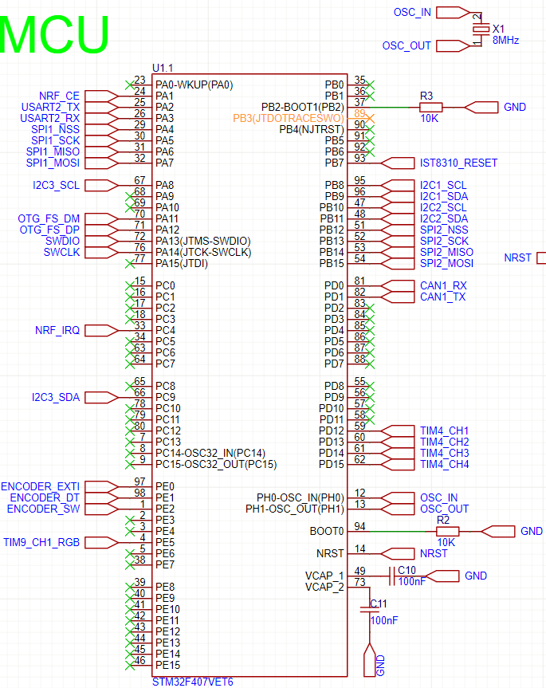

使用cubemx的freertos(v2)套件开发的的飞控。硬件可能会开源。下列叙述主要以时间线为主。详细设计框架在项目中的FC_SYS.mmd中。整个项目使用UTF-8字符编码格式
  
# 复刻
使用cubemx打开.ioc文件，生成代码后再将各文件夹添加到CMakeLists.txt中。该项目使用clangd作为语言服务器，请自行学习并配置.clangd

# 硬件图示

- IIC1 -->IST8310
- IIC2 -->MPU6050
- IIC3 -->OLED(0.96',SSD1306驱动)
- SPI1 -->NRF24L01
- SPI2 -->BMP280
- TIM4 -->PWM输出

完整的硬件设计文档在HARDWARE文件夹中。使用JLC EDA绘制。

# 时间线

## 2025/9/10 
- 完成了mpu6050 ist8310的驱动
- 完成了串口和vofa的双向通讯，支持vofa+控制单姿态和在线调参
- 完成了mahony算法 串级pid算法

## 2025/9/11
- 删除了不必要的文件夹/文件，保持项目的简洁

## 2025/9/13
- 将nrf24l01 mpu6050 ist8310的驱动与硬件层分离，只需提供bsp层的硬件接口即可

## 2025/12/19
- 完善nrf24的驱动
- 修改文件结构，使其更清晰

# 下一步计划
- 
